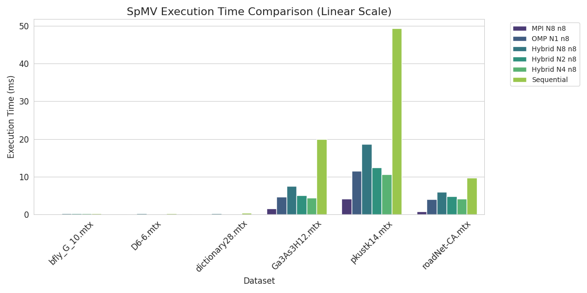
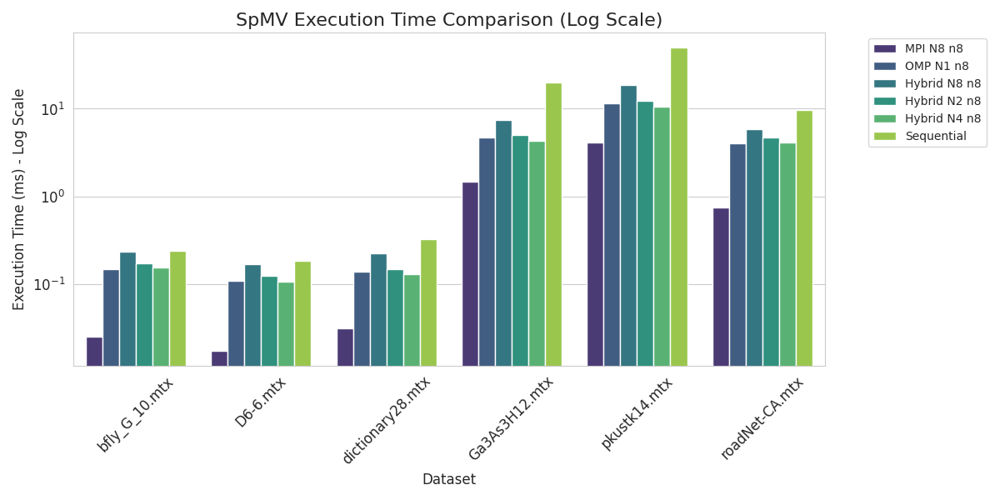

# Experiment 1: Parallel SpMV with OpenMP, MPI, and Hybrid Approaches

## Overview

This experiment implements and benchmarks Sparse Matrix-Vector Multiplication (SpMV) using three parallelization strategies: **OpenMP**, **MPI**, and **Hybrid (MPI+OpenMP)**. All implementations operate on COO (Coordinate) format sparse matrices.

### Core Computation Kernel

The fundamental SpMV operation computes `y = A * x`, where:
- `A` is a sparse matrix in COO format (rows, cols, vals arrays)
- `x` is a dense input vector
- `y` is the dense output vector

**Sequential kernel:**
```c
for (int i = 0; i < num_nonzeros; i++) {
    y[coo.rows[i]] += coo.vals[i] * x[coo.cols[i]];
}
```

**OpenMP kernel:**
```c
#pragma omp parallel for
for (int i = 0; i < num_nonzeros; i++) {
    #pragma omp atomic
    y[coo.rows[i]] += coo.vals[i] * x[coo.cols[i]];
}
```

**MPI approach:** Distributes nonzero chunks across nodes using `MPI_Scatterv()`, computes local y vectors, then reduces with `MPI_Reduce()`.

**Hybrid approach:** Combines MPI distribution with OpenMP threading within each node for nested parallelism.

---

## Environment Setup

**Cluster:** NCSU ARC - Intel Skylake queue (`-p skylake`)  
**Nodes:** c[4-19,26]  
**Hardware Specs:**
- **CPU:** Intel Skylake Silver
- **Motherboard:** Supermicro X11DPU or X11DGQ with IPMI 2.0 PCIe 3
- **Chassis:** 6019U-TRT (1 GPU + 1 half-size PCIe slot) or 1029GQ-TRT (4 GPU + 2 half-size PCIe slots)
- **Memory:** 96GB DDR4 2666 ECC DRAM
- **Storage:** Intel DC S4500 240GB SATA SSD or Samsung 860 EVO 250GB under `/mnt/local`

---

## Datasets

All matrices sourced from [SuiteSparse Matrix Collection](http://sparse.tamu.edu):

| Matrix | Rows | Cols | Nonzeros | Description |
|--------|------|------|----------|-------------|
| `bfly_G_10.mtx` | 10,240 | 10,240 | 98,304 | Butterfly graph |
| `D6-6.mtx` | 9,216 | 9,216 | 73,728 | Structured sparse matrix |
| `dictionary28.mtx` | 52,652 | 52,652 | 89,164 | Dictionary graph |
| `Ga3As3H12.mtx` | 61,349 | 61,349 | 2,982,788 | Quantum chemistry |
| `pkustk14.mtx` | 151,926 | 151,926 | 7,391,792 | Structural engineering |
| `roadNet-CA.mtx` | 1,965,206 | 1,965,206 | 2,766,607 | California road network |

---

## Results Interpretation

**File:** `results.txt`

Each configuration was run **5 times independently**, and reported values are **averages** across these runs.

**Metrics:**
- **Time (ms):** Average execution time per SpMV iteration
- **GFLOP/s:** Computational throughput (2 × nonzeros per second)
- **GB/s:** Memory bandwidth utilization

**Test Procedure:**
- Iteration counts are dynamically determined based on `TIME_LIMIT` and estimated execution time (see `config.h`)
- Warmup iteration precedes benchmarking to stabilize cache and branch prediction
- For debugging, compile with `-D TESTING` flag to output test vectors (`test_y`, `seq_y`)
- Verification via `compare.sh` script ensures correctness across implementations

**Configuration Notation:**
- N = Number of MPI processes
- n = Number of nodes
- threads = OpenMP threads per process

---

## Performance Summary

**Key Observations** (see `OBSERVATIONS.md` for details):

  


1. **MPI dominates** with lowest execution times, especially for large matrices. Efficient workload distribution and minimal contention during reduction operations are key factors.

2. **OpenMP** achieves highest GFLOP/s values, indicating excellent computational efficiency. However, memory bandwidth becomes a bottleneck for larger matrices.

3. **Hybrid approaches** show tradeoffs—Hybrid-4 (N=4, threads=2) balances node-level parallelism and communication overhead better than Hybrid-2 or Hybrid-8.

4. **Memory vs. Compute:** MPI excels in GB/s (memory efficiency), while OpenMP excels in GFLOP/s (compute efficiency). The optimal approach depends on whether the workload is memory-bound or compute-bound.

For detailed performance analysis and implementation explanations, see `OBSERVATIONS.md`.