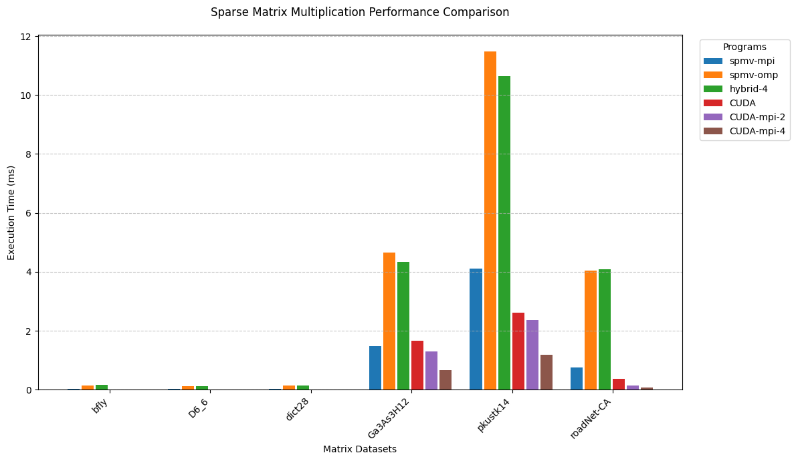

# Performance Analysis of the 5 versions

## General Performance Trends

The CUDA-MPI hybrid implementations consistently outperform all other versions across all test matrices, with the 4-node CUDA-MPI configuration achieving the fastest execution times overall. This suggests that the combination of GPU acceleration with distributed computing offers superior performance for SpMV. The performance advantage becomes particularly pronounced for larger and more complex matrices.

Traditional CPU-based implementations (MPI, OpenMP, and Hybrid-4) generally exhibit slower performance compared to their GPU-accelerated counterparts. Among these, the pure MPI implementation tends to outperform both OpenMP and the hybrid MPI-OpenMP approach for most test cases, indicating that the communication overhead and thread contention of OpenMP might outweigh its benefits.

## Matrix-Specific Observations

### Smaller Matrices (bfly, D6_6, dict28)

For the smaller matrices (bfly, D6_6, and dict28), all implementations achieve sub-millisecond execution times, but the relative performance differences remain significant:

- The CUDA-MPI (4 Nodes) implementation achieves the best performance (0.0037-0.0063 ms)
- The standalone CUDA implementation performs well (0.0085-0.0104 ms) but doesn't match the distributed GPU solutions
- The pure MPI implementation (0.0176-0.0316 ms) significantly outperforms both OpenMP (0.1094-0.1483 ms) and the hybrid approach (0.1074-0.1544 ms) for these smaller matrices
- The relatively poor performance of OpenMP and hybrid approaches for small matrices suggests that the overhead of thread management exceeds the benefits for these workloads

### Larger Matrices (Ga3As3H12, pkustk14, roadNet-CA)

The performance differences become more pronounced with the larger, more complex matrices:

- For Ga3As3H12, execution times range from 0.6637 ms (CUDA-MPI-4) to 4.6648 ms (OpenMP), representing a speedup factor of approximately 7x
- The pkustk14 matrix shows the highest absolute execution times across all implementations, with CUDA-MPI-4 achieving 1.1911 ms compared to OpenMP's 11.4789 ms, nearly a 10x performance difference
- For roadNet-CA, the CUDA-MPI-4 implementation (0.0755 ms) outperforms the OpenMP implementation (4.0408 ms) by a factor of over 50x

## Implementation-Specific Analysis

### MPI Implementation

The pure MPI implementation performs reasonably well, particularly for smaller matrices. It consistently outperforms both OpenMP and the hybrid MPI-OpenMP approach, suggesting effective data distribution and minimal communication overhead for these specific test cases. It still falls significantly behind the GPU-accelerated implementations.

### OpenMP Implementation

OpenMP consistently shows the worst performance across almost all test matrices. This suggests that the thread management overhead and potential memory access patterns in OpenMP may not be well-suited for these specific SpMV operations. Even for highly sparse matrices (like roadNet-CA) OpenMP matches the execution times of Hybrid-MPI-OpenMP implementations. 

### Hybrid MPI-OpenMP on 4 Nodes

The hybrid approach performs marginally better than pure OpenMP in most cases but fails to match the performance of pure MPI. This suggests that the combined communication overhead of both MPI and OpenMP might be negating any potential benefits from the hybrid approach for these specific matrix operations.

### CUDA Implementation

The standalone CUDA implementation demonstrates significant performance improvements over all CPU-based implementations, highlighting the effectiveness of GPU acceleration for SpMV operations.

### CUDA-MPI Hybrid Implementations

The CUDA-MPI hybrid implementations (both 2-node and 4-node) consistently deliver the best performance across all test matrices. The 4-node configuration offers approximately 1.5-2x speedup over the 2-node setup, demonstrating effective scaling with additional GPU resources.

## Conclusion

The performance benefits become increasingly significant with larger, more complex matrices, highlighting the scalability of the GPU-based distributed approaches.