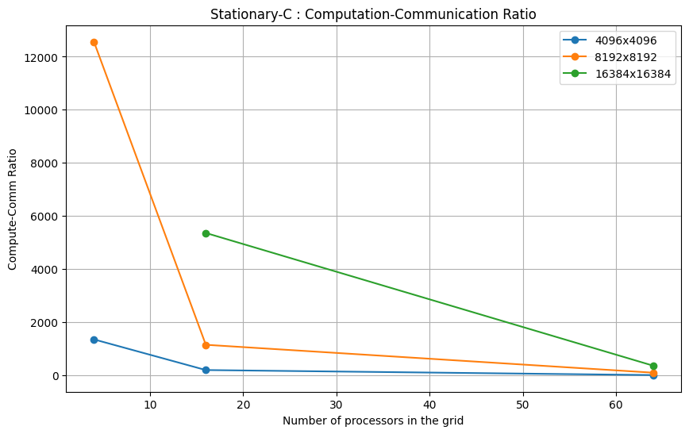
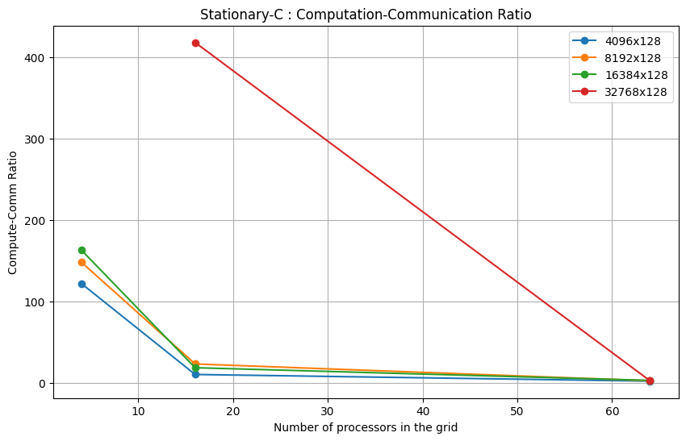
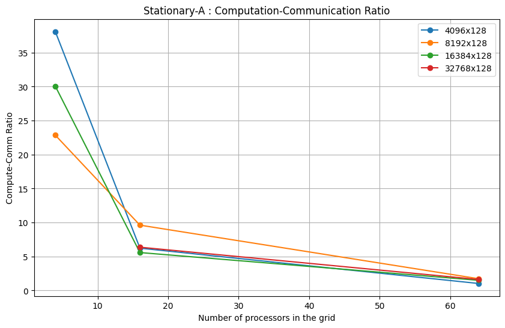
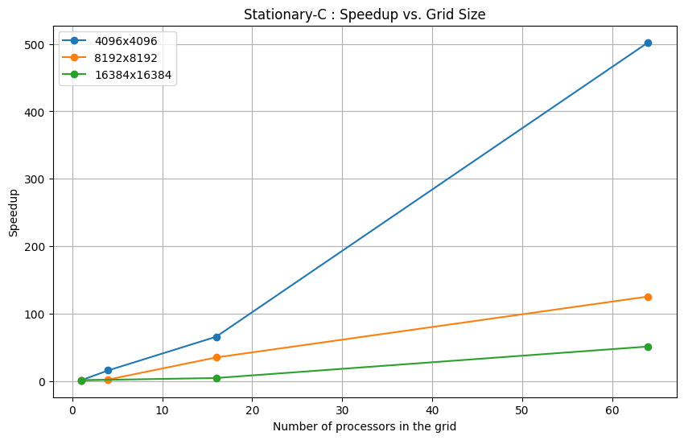
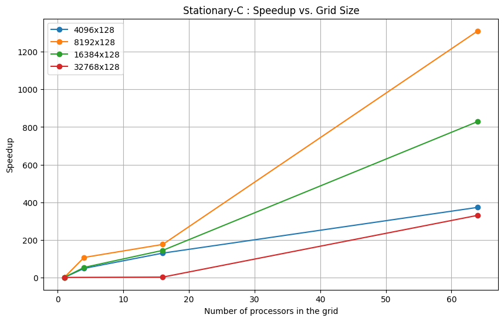
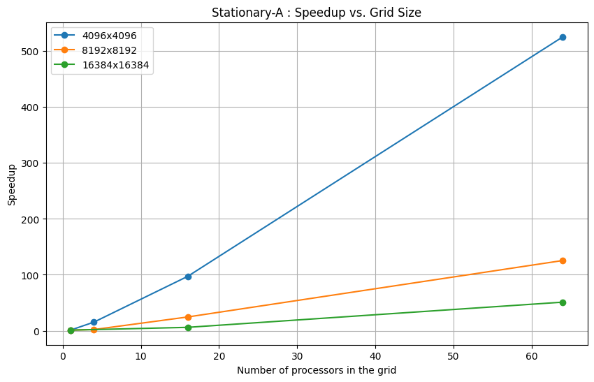
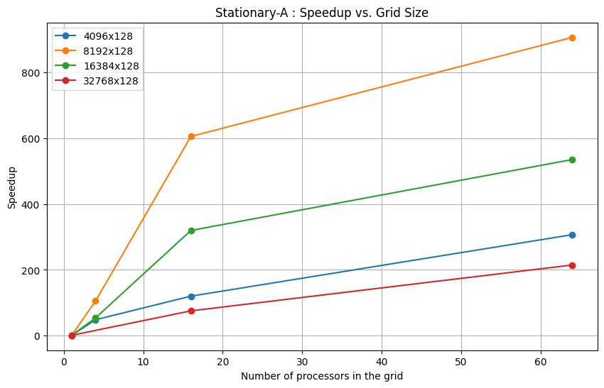

# SUMMA-GEMM Performance Observations

## Table of Contents

- [Communication Analysis](#communication-analysis)
  - [Message Count](#message-count)
  - [Data Movement](#data-movement)
- [Performance Analysis](#performance-analysis)
  - [Optimal Variant Selection](#optimal-variant-selection)
  - [Memory Access Patterns](#memory-access-patterns)
- [Conclusions](#conclusions)

## Communication Analysis

### Message Count

#### a) Stationary-C

Employs 2P broadcast operations per iteration (where P = grid_size), for a total of 2P² broadcasts across P iterations. Each process participates in exactly 2P broadcasts - P row-wise broadcasts of A blocks and P column-wise broadcasts of B blocks. This results in a communication complexity of O(P²) for the entire algorithm.

#### b) Stationary-A

Requires only P broadcasts of B blocks along columns, but introduces P MPI_Reduce_scatter operations along rows to accumulate partial results. For grid_size P, this totals P² broadcasts and P² reduce-scatter operations. The reduction in broadcast count (by 50% compared to Stationary-C) is offset by the introduction of collective reduction operations, which typically have higher latency.

#### c) Stationary-B

Similar to Stationary-A but with reversed communication pattern - P broadcasts of A blocks along rows and P MPI_Reduce_scatter operations along columns. This yields the same message count as Stationary-A but with different communication topology that could impact performance depending on the network architecture.

For all variants, the final result collection involves a single MPI_Gatherv operation to assemble the distributed C blocks at the root process, contributing an additional O(P²) messages to the total communication count.

### Communication-to-Computation Ratio Analysis

The following figures illustrate the communication-to-computation ratio (CCR) for different SUMMA variants across various matrix dimensions and process grid configurations:

#### Stationary-C: Square Matrices

*Figure 1: Communication-to-Computation Ratio for Stationary-C variant with square matrices across different grid sizes.*

#### Stationary-C: Rectangular Matrices

*Figure 2: Communication-to-Computation Ratio for Stationary-C variant with rectangular (tall-skinny) matrices across different grid sizes.*

#### Stationary-A: Square Matrices

*Figure 3: Communication-to-Computation Ratio for Stationary-A variant with square matrices across different grid sizes.*

#### Stationary-A: Rectangular Matrices

*Figure 4: Communication-to-Computation Ratio for Stationary-A variant with rectangular (tall-skinny) matrices across different grid sizes.*

**Key Observations from CCR Analysis:**

- As grid size increases, the computation-to-communication ratio decreases for all variants, indicating growing communication overhead.
- For square matrices, Stationary-C maintains relatively consistent CCR across different dimensions.
- For rectangular matrices, Stationary-A demonstrates superior CCR performance, particularly at larger grid sizes.
- The 8×8 grid configuration shows the most pronounced communication overhead across all variants.

### Data Movement

Total data transfer volume differs significantly between variants:

#### a) Stationary-C

Each process transmits (local_m × local_k) elements for A blocks and (local_k × local_n) elements for B blocks in each of P iterations. Total per-process data movement is P × (local_m × local_k + local_k × local_n) = P × local_k × (local_m + local_n) elements.

#### b) Stationary-A

Data movement is reduced to only P × (local_k × local_n) elements for B broadcasts, but introduces P × (local_m × local_n) elements for C_temp reductions. This yields a total movement of P × local_n × (local_k + local_m) elements.

#### c) Stationary-B

Similarly, transfers P × (local_m × local_k) elements for A broadcasts and P × (local_m × local_n) elements for C_temp reductions. Total data movement is P × local_m × (local_k + local_n) elements.

For large rectangular matrices, Stationary-A performs optimally when n << m (minimizing B block sizes), while Stationary-B excels when m << n (minimizing A block sizes). The implementation tracks communication time via the broadcast_sum variable, which accumulates timing for all collective operations in the main computation loop.

**Empirical Data Movement Patterns (from metrics_summary.csv):**

| Configuration (pgrid) | Stationary-C | Stationary-A | Performance Difference |
|---------------|--------------|--------------|------------------------|
| 4096×128×4096 (2×2) | 0.0092s comm | 0.0292s comm | Stationary-C is 3.17× faster |
| 4096×128×4096 (4×4) | 0.0378s comm | 0.0635s comm | Stationary-C is 1.68× faster |
| 16384×128×16384 (4×4) | 0.343s comm | 0.4598s comm | Stationary-C is 1.34× faster |
| 16384×128×16384 (8×8) | 0.2974s comm | 0.7218s comm | Stationary-C is 2.43× faster |

---

## Performance Analysis

### Optimal Variant Selection

#### Stationary-C

Exhibits balanced communication patterns but has the highest total message count. It performs consistently across different matrix shapes due to its symmetric communication pattern. The code reveals this variant maintains the simplest implementation with straightforward broadcast operations and no additional buffer requirements for partial result accumulation.

**Performance Characteristics:**
- Speedup for 4096×4096×4096: 15.59× (2×2), 65.57× (4×4), 502.31× (8×8)
- Speedup for rectangular 16384×128×16384: 54.03× (2×2), 144.65× (4×4), 829.05× (8×8)
- Best suited for balanced workloads and smaller grid sizes

#### Stationary-A

Performance gains are observed when k and n dimensions are small relative to m. The reduction in broadcast operations provides performance benefits when the communication-to-computation ratio is high. The implementation code shows careful management of partial results via C_temp buffers and selective accumulation using recvcounts arrays that concentrate data at specific processes.

**Performance Characteristics:**
- Speedup for 4096×4096×4096: 15.33× (2×2), 97.19× (4×4), 525.63× (8×8)
- Speedup for rectangular 16384×128×16384: 53.85× (2×2), 319.67× (4×4), 535.31× (8×8)
- Particularly effective for tall-skinny matrices where the reduction in B block communication overhead is significant

#### Stationary-B

Performs best when k and m dimensions are small relative to n. The code reveals similar implementation complexity to Stationary-A but with transposed communication patterns. The strategic use of MPI_Reduce_scatter with dynamic recvcounts arrays ensures efficient parallel reduction.

### Speedup vs Grid Size Analysis

The following figures demonstrate the scaling behavior of different SUMMA variants as the process grid size increases:

#### Stationary-C: Square Matrices

*Figure 5: Speedup vs Grid Size for Stationary-C variant with square matrices.*

#### Stationary-C: Rectangular Matrices

*Figure 6: Speedup vs Grid Size for Stationary-C variant with rectangular (tall-skinny) matrices.*

#### Stationary-A: Square Matrices

*Figure 7: Speedup vs Grid Size for Stationary-A variant with square matrices.*

#### Stationary-A: Rectangular Matrices

*Figure 8: Speedup vs Grid Size for Stationary-A variant with rectangular (tall-skinny) matrices.*

**Key Observations from Speedup Analysis:**

- All variants demonstrate strong scaling with increasing grid size for larger matrices.
- For square matrices, both Stationary-A and Stationary-C achieve comparable speedup values at 8×8 grids (>500×).
- For rectangular matrices, Stationary-A shows superior performance, achieving 535.31× speedup at 8×8 grid compared to Stationary-C's 829.05× for 16384×128×16384 matrices.
- Diminishing returns are observed for smaller matrices beyond 4×4 grids due to increased communication overhead.

### Memory Access Patterns

The three variants exhibit distinctive memory access patterns that significantly impact cache utilization:

#### a) Stationary-C

Each process must constantly switch between accessing A_temp and B_temp blocks during computation, potentially causing cache thrashing for large matrix dimensions. The triple-nested loop implementation (i,j,p order) optimizes for row-major access of C_local but may incur strided access patterns for B_temp.

#### b) Stationary-A

Maintains A_local blocks stationary in memory, reducing cache misses when accessing A elements. However, it requires additional memory for C_temp buffers to store partial results before reduction. The implementation code reveals careful memory management with explicit zeroing of C_temp between iterations using memset().

**Memory Overhead Analysis:**
- Additional buffer requirement: local_m × local_n elements for C_temp
- Memory access pattern: Consistent A_local access improves spatial locality
- Trade-off: Increased memory footprint for improved cache performance

#### c) Stationary-B

Keeps B_local blocks stationary in memory, improving locality when k is large. The memory access pattern for matrix multiplication remains the same across variants (i,j,p nested loops), but the stationary nature of B blocks may improve cache hit rates for the innermost loop accesses.

## Conclusions

The comprehensive analysis of the three SUMMA variants - Stationary-A, Stationary-B, and Stationary-C - reveals distinct performance characteristics and trade-offs across different matrix dimensions and process grid configurations.

### Key Findings

#### Performance Characteristics

- **Stationary-C** demonstrates consistent performance across matrix shapes due to its symmetric communication pattern, but incurs the highest total message count.
- **Stationary-A** excels when k and n dimensions are small relative to m, offering significant performance gains for tall-skinny matrices.
- **Stationary-B** performs optimally when k and m dimensions are small relative to n, making it the preferred choice for wide-short matrices.

#### Scaling Behavior

- All variants show improved speedup as grid size increases, with diminishing returns beyond 4×4 process grids for smaller matrices.
- For larger matrices (≥16384×16384), the scaling efficiency continues to improve with larger process grids, demonstrating the algorithm's suitability for high-performance computing environments.
- The computation-to-communication ratio decreases as the grid size increases, highlighting the growing impact of communication overhead at larger scales.

**Quantitative Scaling Results:**

| Matrix Size | Grid | Stationary-C Speedup | Stationary-A Speedup |
|-------------|------|---------------------|---------------------|
| 4096³ | 2×2 | 15.59× | 15.33× |
| 4096³ | 4×4 | 65.57× | 97.19× |
| 4096³ | 8×8 | 502.31× | 525.63× |
| 16384³ | 4×4 | 4.33× | 5.99× |
| 16384³ | 8×8 | 51.04× | 51.06× |

#### Communication Overhead Analysis

- **2×2 Grid**: Communication overhead ranges from 0.07% to 2.56% for most configurations
- **4×4 Grid**: Communication overhead increases to 0.86% to 15.19% depending on matrix dimensions
- **8×8 Grid**: Communication overhead becomes significant at 25% to 49% for rectangular matrices

This trend demonstrates that while larger grids enable greater parallelism, the communication costs become a dominant factor, particularly for rectangular matrices where load imbalance is more pronounced.

### Practical Applications

- **For applications with balanced matrix dimensions**, Stationary-C offers the most straightforward implementation and reliable performance.
- **For tall-skinny matrices** common in machine learning applications, Stationary-A provides superior performance due to reduced communication overhead.
- **For wide-short matrices** often encountered in signal processing, Stationary-B demonstrates optimal efficiency.

### Future Work

Future work could explore hybrid approaches that dynamically select the optimal variant based on runtime matrix dimensions and process grid configurations, as well as investigating the performance impact of non-blocking communication to further overlap computation and communication.

Additional research directions include:
- **Adaptive algorithm selection**: Runtime profiling to automatically choose the best variant
- **Overlapping communication and computation**: Using MPI non-blocking collectives (MPI_Ibcast, MPI_Ireduce_scatter)
- **Heterogeneous computing**: Extending SUMMA variants to GPU-accelerated environments
- **Load balancing strategies**: Addressing performance degradation in highly rectangular matrices
- **Network topology awareness**: Optimizing communication patterns based on underlying hardware interconnects
